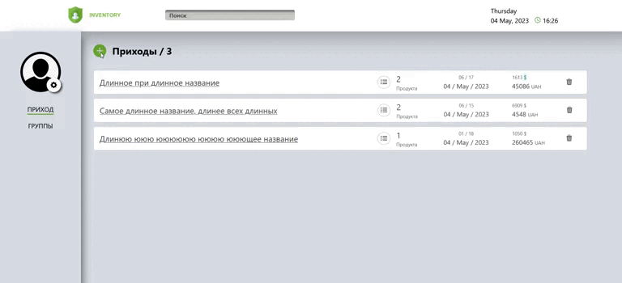
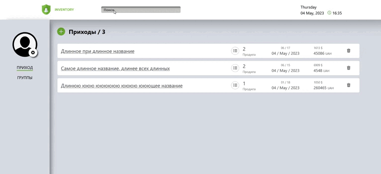
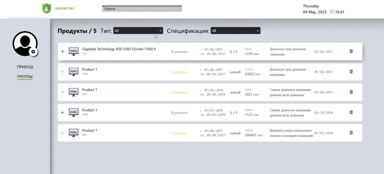

# Inventory app

### [Link app](https://iventory-vfnh.vercel.app/orders)

---

 Це було моє перше знайомство з Vue. Це чудовий досвід.

У додатку ще є що вдосконалювати, але головне завдання виконано і все працює.

---

## Додаток надає можливість:

- створення і видалення замовленнь та товарів;
  
- пошук замовлення по назві;
  
- сортування товарів за типом та специфікацією;
  

---

Для демо версії було додані дефолтні данні.

---

## Як запустит проєкт локально?

- клонуйте репозиторій;
- в терміналі пропишіть команду npm install
- коли завантаження завершиться виконайте команду npm run start
